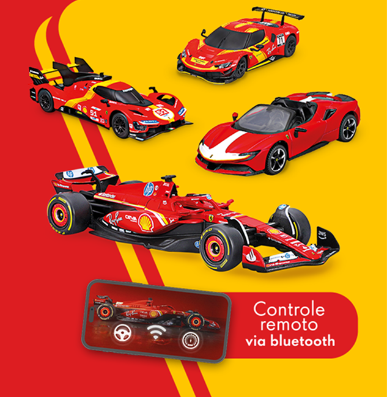
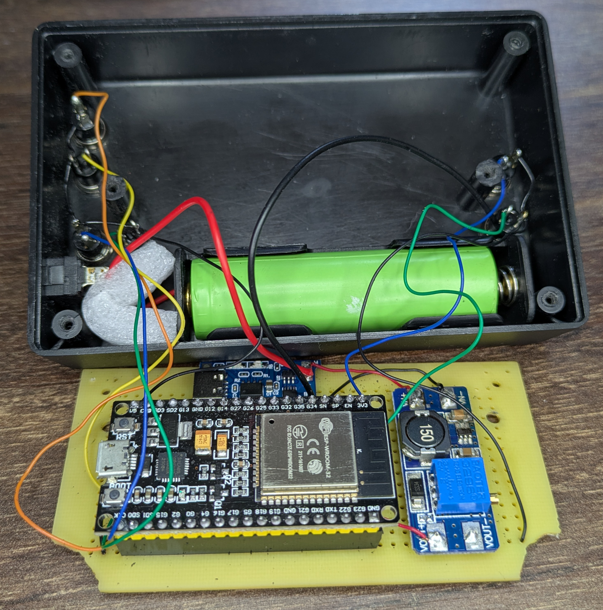

# README
With that code you will be able to control Shell Racing Legends cars from ESP32. Currently
the direction is controlled by pulling the defined pins to ground, but using ESP32
you can put sensors like accelerometers, gyros, joysticks whatever you like.

## Protocol summary (Shell Racing Legends, 2024+)
- Cars advertise as `SL-*` (e.g. `SL-296 GTB`) and expose service `0xFFF0`.
- Control packets are 8 bytes written to characteristic `0xFFF1`:
	`[mode, up, down, left, right, light, turbo, donut]` (`0/1` bits for each flag).
- Telemetry is expected on `0xFFF2`. Most units only echo control state; format is still under investigation.
- Battery level is available through the standard GATT service `0x180F` / characteristic `0x2A19` (single byte percentage, optional notifications).
- No encryption or keep-alive frame is required; packets are sent on demand whenever inputs change.

### Supported models

| Internal Name       | Display Name                        | Bluetooth ID          |
|---------------------|-------------------------------------|-----------------------|
| 12CILINDRI          | 12Cilindri                          | `SL-12Cilindri`       |
| 296GT3              | 296 GT3                             | `SL-296 GT3`          |
| 296GTB              | 296 GTB                             | `SL-296 GTB`          |
| 330P                | 330 P 1965                          | `---`                 |
| 330P4               | 330 P4                              | `SL-330 P4(1967)`     |
| 488EVO              | 488 Challenge Evo                   | `SL-488 Challenge Evo`|
| 488GTE              | 488 GTE - AF Corse #51 2019         | `SL-488 GTE`          |
| 499P                | 499 P                               | `SL-499P`             |
| 499P(2024)          | 499P(2024)                          | `SL-499P N`           |
| 512S                | 512 S 1970                          | `---`                 |
| DaytonaSP3          | Daytona SP3                         | `SL-Daytona SP3`      |
| F175                | F1-75                               | `SL-F1-75`            |
| FXXK                | FXX-K EVO                           | `SL-FXX-K Evo`        |
| PUROSANGUE          | Purosangue                          | `SL-Purosangue`       |
| SF1000              | SF1000 - Tuscan GP - Ferrari 1000   | `SL-SF1000`           |
| SF23                | SF-23                               | `SL-SF-23`            |
| SF24                | SF-24                               | `SL-SF-24`            |
| SF90SPIDER          | SF90 Spider                         | `SL-SF90 Spider`      |
| SF90SPIDER(BLACK)   | SF90 Spider (Black)                 | `SL-SF90 Spider N`    |
| ShellCar            | *(string vazia)*                    | `SL-Shell Car`        |

### Differences from Brandbase Gen-2 cars (2019-2020)
- The previous protocol used 16-byte AES-128 encrypted frames with the `CTL` header and required a tight 10 ms transmit schedule. The new cars are plain-text and event-driven.
- Legacy cars used proprietary characteristics (`d44bc439-abfd-45a2-b575-925416129600/01`). The new fleet uses the 16-bit UUIDs above plus the standard battery service.
- Advertising changed from `QCAR-*` to `SL-*`, and device matching now happens by name rather than MAC prefix.
- Battery telemetry no longer needs decryption; standard BLE clients can read it without custom logic.
- New control flags: `mode` toggles between UI drive modes, and `donut` triggers the show-off maneuver unavailable in the older hardware.

Documentation on the previous generation is available at:
- https://gist.github.com/scrool/e79d6a4cb50c26499746f4fe473b3768
- https://github.com/tmk907/RacingCarsController
- https://github.com/krisstakos/ShellRacingRemote

## What works?
```
Controlling the car in all directions including combinations like up+left
Robust connection and scanning
Turbo button is working
Lights also if supported by car
Battery percentage is printed every 60sec in the UART
```



## How to compile?
```
You can use platformio or Arduino IDE(make sure you don't have third party BLE libraries)
```

## Included tools
- `src/main.cpp`: ESP32 firmware updated for the Shell Racing Legends BLE protocol (8-byte control payload, standard battery service, optional telemetry subscription).
- `control.py`: pygame-based desktop controller that mirrors the official app UI and supports true key press/release events.
- `test.py`: asyncio CLI helper for crafting bespoke control packets, reading battery data, and sniffing notifications.
